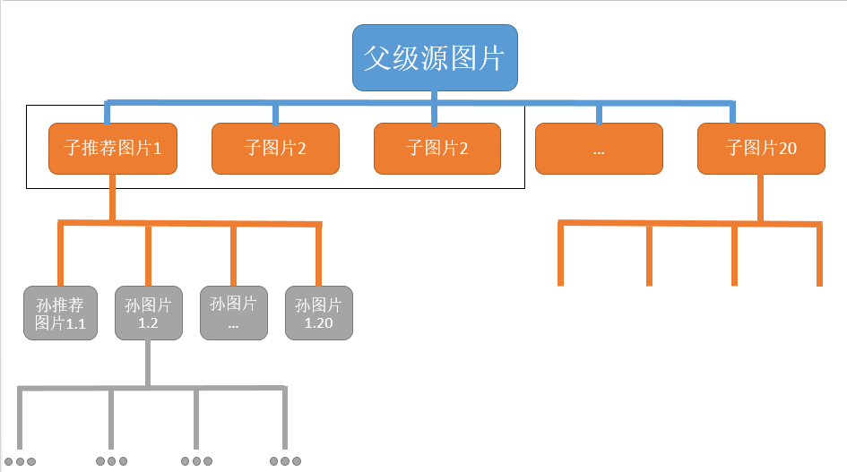

#  Pinterest爬虫开发日记

> StartDate		22.08.11
>
> Author			AInoriex

## 目标网站

​	https://www.pinterest.com

### 			备注

- 需要翻墙
- 瀑布式图片网站（类似百度图片）
- 动态nodejs加载


## 项目需求

​		提供随机一张pinterest图片的url地址，每轮根据该图片的下方推荐系统自动生成的图片列表选出前20张相关的图片存入数据库，并在下一轮由这n张（3<n<20）图片递归搜索更多相关图片



## 流程记录

### 		完全使用八爪鱼平台编写脚本

> Version		ver0.1
>
> Date			22.08.12 a.m.
>
> FileName	[pin_test.otd](.\\BazhaoFish)

​	【功能】能持续抓取目标关键字缩略图的瀑布式页面

​	【BUG】还不能实现爬取文件原图，载入“下载页面”选项出现问题，后续需要抓包分析
​				   (需要把缩略图url和原图下载的url对应起来？)

​	【不足】八爪鱼将功能集成度过高，导致灵活度不足，循环上无法根据此流程中获取的数据放入循环中循环，无法满足项目需求

> @官方文档参考
>
> [Ajax网页采集方法（最新） - 八爪鱼采集器 (bazhuayu.com)](https://www.bazhuayu.com/tutorial8/81ajax)
>
> [瀑布流网站图片采集方法，以百度图片采集为例 - 八爪鱼采集器 (bazhuayu.com)](https://www.bazhuayu.com/tutorial/bdpiccj)

### 	

### 		半自动化pyautogui + 半自动化八爪鱼

#### 		Version 0.1

> FileName	startHere_v0.1.py
>
> Date			22.08.18

- ##### 📝 遇到的问题 / 采取该方式原因

  - 八爪鱼自动化将步骤封装过于高度化，以至于无法很灵活处理该业务需求，即由于八爪鱼的循环列表仅可以从现有的/已知的固定数据列表遍历，无法根据当前爬虫中爬取的数据放入循环遍历递归
  - 大飞哥的提议下，八爪鱼仅负责处理每次获取一个图片地址获取下方对应的n张图片的缩略图/链接需求，八爪鱼之外采用python的pyautogui库执行半自动化+半自动化工作

- ##### 🔨 涉及工具

  - pyautogui + openCV + xlrd + xlutils + queue + pymysql + 八爪鱼

- ##### ⭐ 功能

  - 输入起始url和获取图片数量，基于队列存储需要递归的url，每次取出url使用pyautogui自动化操作八爪鱼进行爬取，爬取完毕后自动化导入数据库，并从数据库select出继续递归的url放入队列

- ##### ⭐ 亮点

  - 代码根据功能划分多个py文件，了解`__init__`代码的用法
  - 递归url数据结构采用队列而非列表，大大减少内存占用空间
  - 使用水哥waterRPA代码进行自动化操作八爪鱼，并多次实验能够精准进行自动化点击/输入
  - 代码运行时能详细但不冗余打印出当前所在步骤，程序执行完成能反馈完成率
  - 代码每个模块采用多个`try...except`结构，出现error时候能及时捕捉使得不至于主程序崩溃退出
  - 目前获取图片数目为相关的前4张，能通过获取20张图片的测试案例

- ##### 📌 后续补足 / 现存和新的BUG

  - 无论是八爪鱼亦或sql数据库增加表头`childlink`数量至20个，同时需要修改`select`字段按需（增添多一个输入参数）取出和八爪鱼导出数据对应关系
  - 采用`logging`模块记录日志
  - 增加判断情况，中途`Ctrl C`时能优雅退出并输出下载结果和当前下载进度
  - 考虑八爪鱼中途识别不出目标而超时退出循环
  - 流程结束输出信息的完善

#### 		Version 0.2

> FileName	startHere_v0.2.py
>
> Date			22.08.19

- ##### 📝 遇到的问题 / 采取该方式原因 /👉后续解决步骤

  - 八爪鱼内同类型相似字段添加的繁琐问题

    - 尝试使用`导出配置文件`使用notepad手动修改，发现文件格式类似json但具体字段相当繁琐，弃用

      👉 最后采用`复制字段`功能手动修改名字和xpath

      👉 同时由于采集数据操作包括采集缩略图地址和图片链接地址两项，放在同一操作下字段

  - 页面动态加载爬取的固定xpath指向对象发生偏移的问题

    - 幸亏除了八爪鱼浏览器下刷新页面推送的相关图片和chrome浏览器推送的页面相同，能使用`开发者模式`debug，目前只想到需要合理控制页面滚动幅度保证xpath的div[2]指向主图下方推送的“标准“第一张相关图

    - 稳定不发生偏移下，获取div标签个数的情况

      - 刚加载页面且不滚动（最多能获取div标签6~7个）；
      - 滚动页面（最多获取div17~18个）；

      👉 填写好20个左右爬取字段后，在八爪鱼任务界面的浏览器缓慢滚动，观察“一页”的最大图片呈现数，基于此来负反馈修改爬取字段

      👉 如何判断当前字段数在采集时是否发生xpath偏移现象：在任务界面浏览器缓慢滚动截取“标准”前几项url地址，之后开始`采集`得出的数据表对比二者的url是否一致

  - 采集数据时窗口大小的不同导致采集结果的不同

    - 多次实验下，发现采集窗口全屏化下出现图片更多，减小了因为滚动页面而出现的xpath对象偏移的影响

      👉 在`cmd.txt`中增添八爪鱼采集全屏化操作

  - 八爪鱼控制翻页的方式不同导致采集结果的不同

    - 多次实验下，发现`滚动到底部`比`向下滚动一屏`单次操作下出图数量更多且效率更高

    - **但**是`滚动到底部`后xpath产生偏移现象概率高很多

      👉最终还是采取`向下滚动一屏`共滚动两次更能稳妥获取标准的前20张相关图片

  - 最终采集成功(xpath不偏移)样例

    - https://www.pinterest.com/pin/331436853839230401/
    - https://www.pinterest.com/pin/155655730863375651/
    - https://www.pinterest.com/pin/524176844143482723/
    - https://www.pinterest.com/pin/18084835994883539/
    - https://www.pinterest.com/pin/18507048460187300/
    - 。。。

  - 小总结

    - 警惕nodejs这样的动态页面，看似单向瀑布式页面（页面尾部是动态）实则两头都是瀑布式（头尾都是动态加载）
    - 该需求下，页面占据屏幕越大，单个屏幕显示的图片就越多，xpath偏移概率越小
      👉 全屏化模拟浏览页面的爬虫（selenium）

- ##### ⭐功能完善 / BUG修复

  - 增加数据库表头缩略图的地址/下载链接字段个数至20个
  - 增添了八爪鱼缩略图`格式化规则`，这之后可弃用`pic2origin`
  - 八爪鱼脚本运行采集数据时，加入了窗口全屏化操作，采集数据更准确且高效
  - 主程序增添参数`每次加入队列二次搜索的图片个数n`（1<n<21）
  - 优化程序提示信息`[Info]`,`[Notice]`,`[Warn]`,`[ERR]`
  - 修改`mySelect`函数参数，增添`mode`选择性select出缩略图下载链接or缩略图地址

- ##### 📌 后续补足 / 现存和新的BUG

  - 判断主程序开始的用户输入类型，数值等边缘情况
  - 主程序参数增添输入队列递归层数
  - 八爪鱼脚本运行偏离航线/超时等长时间卡在原地的对策
  - 八爪鱼脚本某些原因(网络/页面无法加载/程序获取字段失败等)获取数据为空重试的对策
  - 修改`cmd.txt`文件失败时情况的逻辑分析（continue or break）
  - logging模块的脚本运行日志写入
  - 【BUG】select获取数据为空但仍能获取空串
  - 【BUG】某些原图格式是除了`.jpg`的其他格式（exp：`.png`）但无法判断仍存入DB为`.jpg`
  - 【BUG】下方推荐图片为视频时无法获取缩略图相关信息

#### 	Version 0.3

> FileName	startHere_v0.3.py
>
> Date			22.08.26

-  ⭐ What's New
   - 新增层数遍历深度的结束循环条件
   - 改善了八爪鱼爬取窗口结束时退出的图标定位，在会议投屏时也能正常运行
   - 添加`cmd.txt`步骤操作，在八爪鱼爬取中能显示浏览器实时操作


## 其他脚本开发

### $ ~~pinOrigin~~ (弃用)

- ⭐ 功能：读取xls文档的缩略图地址，并在新一列插入原图url地址
- 🔨 涉及库：`xlrd`,`xlutils`,`os`,`time`

> Version	0.1beta
>
> Date		22.08.15

- 📌bug & question
  1. 八爪鱼默认导出`.xlsx`格式但不支持，需要手动修改（能否copy出新的一份进行修改）
  2. 表格中若存在空白行或与结果错位（删空白行?）

> Version	0.2
>
> Date		22.08.16

- 📌bug & question
  1. 表格存在空白行则跳过该条识别并对应结果也跳过该行，在readbook识别存入列表增加了判断url情况
  2. 使用os.path检测文件及目录
  3. 开发两种类型脚本？ 
     - 打包成exe输入文件名直接执行处理 
     - 命令行形式放入path调用输入指定参数处理xlsx


### $ pin2Download

> Version	0.1beta
>
> Date		22.08.17

- 🧩 功能：命令行读取xls文档的原图地址，批量下载原图保存至指定文件夹
- 🔨 涉及库：argparse(未实现)，request，xlrd，os

> Version		0.3
>
> Date			22.08.17
>
> Comment	配套BazhaoFish_v0.3使用

- 🧩 功能

  - 从xls获取下载链接改进到从本地数据库获取链接，去重然后批量保存到只当文件夹
- ⭐ 亮点

  -  封装两个py文件，一个是`GetUrlFromDB.py`负责从数据库获取所有待下载的原图链接，另一个是`GetRequests.py`负责向所有链接地址发送请求并下载
  -  防止ProxyError，增添进度每前进10%等待20秒再继续下载的功能
  -  每次下载记录爬取结束状态，最后下载完毕输出下载成功/重复/失败/总数等个数的信息
  - `GetUrlFromDB.py`
    - 重写了`BazhaoFish`中的`mySelct`函数，修改sql语句的where字段从而能获取所有子下载链接
  - `GetRequests.py`
    - 从用id+时间戳命名图片名字到取下载地址最后一栏内容(pinterest内唯一uid)命名存储（防止重复命名/命名混乱)
    - 使用时间戳命名数组作为`group_name`进行存储
    - 判断待下载图片在下载路径中是否存在（防止重复下载)
    - 修改爬取失效逻辑，`.jpg`格式行不通则等待两秒后更换`.png`爬取（增加爬取准确率和存活率）
    - 若这二者格式都爬取失败，则在下载文件夹下存入失败的url来保存错误信息
    - 采用随机header方式发送请求并爬取
- 📌 待改进/完善

  -  整体流程考虑如何从收到url到返回所有图片压缩包资源的自动化
  -  从input输入参数改进为用`argparser`输入参数
  -  报错信息写入logging库
  -  `GetUrlFromDB.py`
    - 数据库登录信息，表信息等用参数指定
    - 暂时不需要并发查询数据库，以后可能需要
  -  `GetRequests.py`
    - 后续可能要采用代理ip池进行爬取
    - 后续可能需要采用并发进行爬取下


## 联系作者

```apl
Wechat	AInoriex
QQ		1414113646
Github	AInoriex
```

